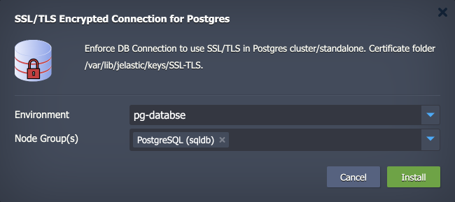
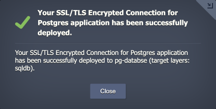
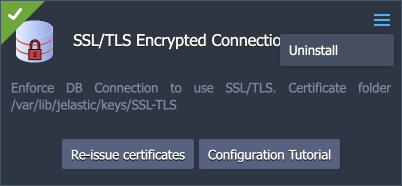

<p align="center"></p>


# SSL/TLS Encrypted Connection for PostgreSQL

The add-on automates the SSL/TLS certificate generation and encryption configuration for both standalone and cluster PostgreSQL solutions on the Virtuozzo Application Platform. Get this standard security measure in just a minute, ensuring secure data exchange between server and client.


## Add-On Installation

The add-on can be installed on top of the **PostgreSQL** and **Pgpool** (for database clusters) nodes only.

1\. Log into your Virtuozzo Application Platform and [import](https://www.virtuozzo.com/application-platform-docs/environment-import/) the add-on's manifest from this repository:

```
https://github.com/jelastic-jps/postgres-ssl-addon/blob/main/manifest.jps
```


Click **Import** to proceed.

2\. Within the opened installation window, select the target **Environment** and **Node Group(s)** where the add-on will be installed.



> **Note:** Both layers should be selected if installing for the **PostgreSQL cluster with Pgpool** load balancing nodes.

Click **Install** to continue.

3\. In a minute, your environment will be configured.



You can find generated SSL certificates under the **/var/lib/jelastic/keys/SSL-TLS** folder.


## Add-On Configuration

After the installation, the add-on can be found under the **Add-Ons** tab for the appropriate layer.


The available configuration options are straightforward:

- **Re-issue certificates** – generates SSL certificates for secure connection anew
- **Configuration Tutorial** – opens the documentation for *[Establishing SSL Connection to PostgreSQL](https://www.virtuozzo.com/application-platform-docs/ssl-for-pgsql/)* manually
- **Uninstall** (in the add-on's menu in the top-right corner) - removes the add-on from the layer




## Secure Connection to PostgreSQL

1\. The ***server-side encryption*** works immediately after the installation. You can check it by providing the client with the access credentials and establishing the connection. We’ll use the ***[psql](https://www.postgresql.org/docs/current/app-psql.html)*** utility for this example.

You can use an [endpoint](https://www.virtuozzo.com/application-platform-docs/endpoints/) or [public IP](https://www.virtuozzo.com/application-platform-docs/public-ip/) as your database entry point. Let’s check the endpoint example:


Connect from the client with the following command:

```
psql -U {userName} {dbName} -h {host} -p {port} -W
```


2\. For ***server- and client-side encryption***, SSL certificate files should be provided to the client. You can find these files in the **/var/lib/jelastic/keys/SSL-TLS/client** directory after the add-on installation.


The client needs to upload the certificate files (*client.crt*, *client.key*, *root.crt*) to their computer/container/VM. After that connection can be established as follows:

```
psql "sslmode=verify-ca sslrootcert=root.crt sslcert=client.crt sslkey=client.key hostaddr={publicIp} port={port} user={userName} dbname={dbName}"
```

